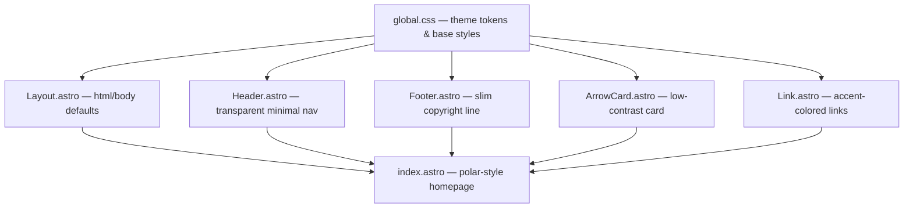
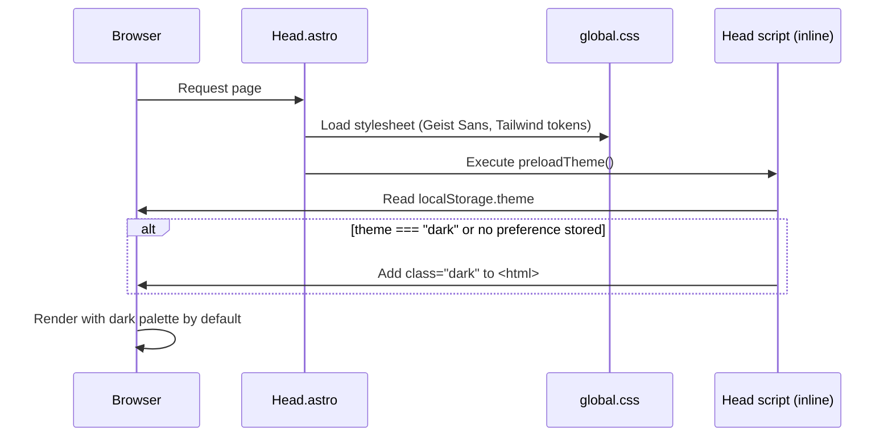
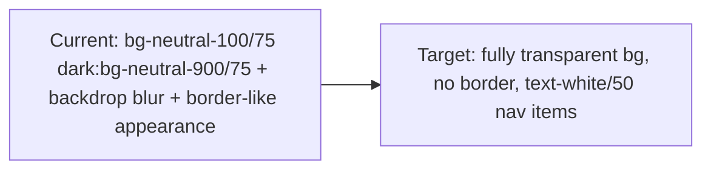

# Design Document: itspolar-theme-clone

## Overview

This feature transforms the existing astro-micro blog theme to visually clone the aesthetic of [itspolar.dev](https://www.itspolar.dev/) — a dark-first, minimal, single-column developer portfolio. The work involves restyling the global CSS, modifying core layout components (Header, Footer, Container), updating the ArrowCard and Link components, and reworking the homepage to match the itspolar.dev personal-intro structure.

The goal is a pure visual/style transformation. No new Astro integrations, no new npm dependencies, and no architectural changes to routing or content collections. All changes stay within the existing file set, targeting CSS custom properties, Tailwind utility classes, and Astro component markup.

The resulting site should feel quiet, professional, and developer-portfolio-like — very dark background, near-white muted body text, crisp white headings, a subtle blue/teal link accent, and breathing room via generous spacing and a narrow centred column.

---

## Architecture

The change touches five layers:



**Touch points summary:**

| File | Change scope |
|---|---|
| `src/styles/global.css` | Color palette, typography scale, base styles, code block colors |
| `src/components/Header.astro` | Transparent bg, remove border, minimal markup |
| `src/components/Footer.astro` | Remove theme-toggle buttons, keep slim copyright + email |
| `src/components/ArrowCard.astro` | Lower border opacity, darker hover state |
| `src/components/Link.astro` | Accent-blue color, subtle decoration |
| `src/pages/index.astro` | Polar-style intro: greeting, bio, blog/projects sections |
| `src/consts.ts` | Update SITE.TITLE and remove emoji |

No new files are needed. The `Container.astro` max-width is already correct (`max-w-(--breakpoint-sm)` ≈ 640px) and requires no changes.

---

## Sequence Diagrams

### Page Load & Theme Initialization



Because itspolar.dev is dark-first, the default `color-scheme` is set to `dark` and `preloadTheme()` in `Head.astro` is configured to default to dark when no preference is stored.

### Component Render Flow

```mermaid
sequenceDiagram
    participant Layout.astro
    participant Header.astro
    participant index.astro (slot)
    participant Footer.astro

    Layout.astro->>Header.astro: Render transparent minimal header
    Layout.astro->>index.astro (slot): Render polar homepage content
    index.astro (slot)->>ArrowCard.astro: Render blog/project cards (dark-styled)
    index.astro (slot)->>Link.astro: Render accent-colored links
    Layout.astro->>Footer.astro: Render slim footer (copyright only)
```

---

## Components and Interfaces

### Component: global.css (Theme Tokens)

**Purpose**: Central source of truth for all design tokens — colors, typography, spacing defaults, and dark/light overrides.

**Key token changes:**

```css
/* New palette — replaces neutral-100/neutral-900 defaults */
--color-bg:        #0c0c0c;   /* near-black page background */
--color-surface:   #111111;   /* slightly lighter surface (cards, code) */
--color-border:    rgba(255,255,255,0.08);  /* very low contrast border */
--color-text:      rgba(255,255,255,0.70);  /* muted body text */
--color-heading:   #ffffff;   /* full white headings */
--color-accent:    #60a5fa;   /* blue-400 — link accent */
--color-accent-hover: #93c5fd; /* blue-300 — hover state */
--color-muted:     rgba(255,255,255,0.40);  /* timestamps, secondary text */
```

**Responsibilities:**
- Define `@theme` font stacks (unchanged — Geist Sans / Geist Mono)
- Override `body` background and text color for dark-first
- Set `html { color-scheme: dark }` as the default
- Restyle `header`, `footer`, `article`, `pre` to match dark palette
- Provide `.animate` keyframe (unchanged)
- Update Shiki code block colors for dark theme

### Component: Header.astro

**Purpose**: Minimal top navigation — site name on left, blog/projects/search on right. No visible background or border in the hero area.

**Interface** (props unchanged):
```typescript
// No props — reads from SITE consts
```

**Current → Target changes:**



**Responsibilities:**
- Render `SITE.TITLE` as a plain text link (no emoji)
- Nav links use muted text (`text-white/50`) with hover brightening to `text-white`
- Search button: ghost style with `border-white/10`
- `header` element: `bg-transparent` — no blur/saturate in the hero area

### Component: Footer.astro

**Purpose**: Single-line slim footer with copyright on left, email link on right. Theme toggle buttons are removed to reduce visual noise (matching itspolar.dev's minimal footer).

**Interface:**
```typescript
// No props — reads SITE.TITLE and SITE.EMAIL from consts
```

**Responsibilities:**
- Render `© {year} · {SITE.TITLE}` on the left
- Render `SITE.EMAIL` as an accent-colored link on the right
- Remove light/dark/system theme buttons entirely
- Keep `BackToTop` component

**Markup sketch:**
```astro
<footer>
  <Container>
    <div class="flex items-center justify-between text-sm text-white/40">
      <span>&copy; {year} · {SITE.TITLE}</span>
      <Link href={`mailto:${SITE.EMAIL}`}>{SITE.EMAIL}</Link>
    </div>
  </Container>
</footer>
```

> **Note on theme toggle removal**: The theme toggle buttons are the primary way users switch between light/dark. Removing them means the site is permanently dark (unless the user changes `prefers-color-scheme`). This is the intentional design goal — dark-first matching itspolar.dev. The inline script in `Head.astro` still respects `prefers-color-scheme` for accessibility.

### Component: ArrowCard.astro

**Purpose**: Clickable card linking to a blog post or project. Needs to feel low-contrast and dark on the dark background.

**Interface** (unchanged):
```typescript
type Props = {
  entry: CollectionEntry<"blog"> | CollectionEntry<"projects">;
}
```

**Current → Target changes:**

| Property | Current | Target |
|---|---|---|
| Border | `border-black/15 dark:border-white/20` | `border-white/8` |
| Hover bg | `hover:bg-black/5 dark:hover:bg-white/5` | `hover:bg-white/5` |
| Hover text | `hover:text-black dark:hover:text-white` | `hover:text-white` |
| Rounded | `rounded-lg` | `rounded-md` |
| Title color | inherits | `text-white/90` |
| Description color | inherits | `text-white/50 text-sm` |

### Component: Link.astro

**Purpose**: Inline hyperlink. In the polar theme, links use the blue accent color rather than inheriting current text color.

**Interface** (unchanged):
```typescript
type Props = {
  href: string;
  external?: boolean;
  underline?: boolean;
  group?: boolean;
}
```

**Current → Target changes:**

```css
/* Current: text-current (inherits body text color) */
/* Target:  text-blue-400 (#60a5fa) with hover to text-blue-300 */

/* Current: decoration-black/30 dark:decoration-white/30 */
/* Target:  decoration-blue-400/40 hover:decoration-blue-300/60 */
```

---

## Data Models

### SITE Configuration (src/consts.ts)

```typescript
export const SITE: Site = {
  TITLE: "polar",           // updated — no emoji, lowercase casual like itspolar.dev
  DESCRIPTION: "...",
  EMAIL: "you@example.com",
  NUM_POSTS_ON_HOMEPAGE: 5,
  NUM_PROJECTS_ON_HOMEPAGE: 3,
};
```

### Homepage Content Structure (src/pages/index.astro)

The polar-style homepage has this logical structure:

```typescript
interface HomepageSection {
  id: "intro" | "posts" | "projects" | "connect";
  heading?: string;        // section label
  animate: boolean;        // staggered fade-in
}

// Sections rendered in order:
const sections: HomepageSection[] = [
  { id: "intro",    animate: false },  // greeting + bio — visible immediately
  { id: "posts",    heading: "writing",  animate: true },
  { id: "projects", heading: "projects", animate: true },
  { id: "connect",  heading: "contact",  animate: true },
];
```

The intro section uses a casual, friendly tone:
```markdown
**hiya! i'm [name]**
[role/bio description — 1–2 lines]
```

---

## Algorithmic Pseudocode

### Algorithm: Default-Dark Theme Initialization

This is the critical behavioral change — the site must default to **dark** instead of respecting system preference as the fallback.

```pascal
PROCEDURE preloadTheme()
  INPUT: localStorage, window.matchMedia
  OUTPUT: sets class "dark" on document.documentElement

  SEQUENCE
    userTheme ← localStorage.getItem("theme")

    IF userTheme = "light" THEN
      toggleTheme(false)                  // explicit light preference
    ELSE IF userTheme = "dark" THEN
      toggleTheme(true)                   // explicit dark preference
    ELSE
      // No stored preference → DEFAULT TO DARK (changed from system-based)
      toggleTheme(true)
    END IF
  END SEQUENCE
END PROCEDURE
```

**Preconditions:**
- `localStorage` is accessible (not in SSR context)
- `toggleTheme(dark: boolean)` function exists and adds/removes `class="dark"` on `<html>`

**Postconditions:**
- `document.documentElement.classList` contains `"dark"` unless user explicitly chose `"light"`
- Visual theme matches stored preference or defaults to dark

**Change from current behavior**: Currently `preloadTheme()` falls back to `window.matchMedia("(prefers-color-scheme: dark)").matches`. The new behavior ignores system preference when no explicit choice is stored, defaulting to dark.

### Algorithm: Theme Toggle Button Removal

Because the footer theme buttons are removed, the `updateThemeButtons()` function in `Head.astro` must be guarded to not throw when those DOM elements no longer exist.

```pascal
PROCEDURE updateThemeButtons()
  INPUT: DOM elements (may be null)
  OUTPUT: updates active state classes

  SEQUENCE
    lightBtn   ← getElementById("light-theme-button")   // may be null
    darkBtn    ← getElementById("dark-theme-button")    // may be null
    systemBtn  ← getElementById("system-theme-button") // may be null

    // All operations already use optional chaining (?.) — no code change needed
    // The existing guard `button?.classList.remove(...)` handles null safely
  END SEQUENCE
END PROCEDURE
```

**Postconditions:**
- No runtime errors even when footer buttons are absent
- Existing `?.` optional chaining in `Head.astro` script already handles this correctly — no code change needed

### Algorithm: Staggered Animation on Homepage

```pascal
PROCEDURE animate()
  INPUT: DOM elements with class "animate"
  OUTPUT: each element transitions from opacity-0 to opacity-100 with stagger

  SEQUENCE
    elements ← querySelectorAll(".animate")

    FOR i FROM 0 TO elements.length - 1 DO
      INVARIANT: elements[0..i-1] already have class "show" scheduled
      
      SET timeout ← i * 100  // 100ms stagger
      SCHEDULE setTimeout(() => elements[i].classList.add("show"), timeout)
    END FOR
  END SEQUENCE
END PROCEDURE
```

**Preconditions:**
- `.animate` class elements exist in the DOM
- CSS defines `.animate { opacity: 0; transform: translateY(-12px) }` and `.animate.show { opacity: 1; transform: translateY(0) }`

**Postconditions:**
- Each `.animate` element fades in with a 100ms offset from the previous
- Elements without `.animate` (e.g., the intro `<h1>`) appear immediately

---

## Key Functions with Formal Specifications

### Function: toggleTheme(dark: boolean)

```typescript
function toggleTheme(dark: boolean): void
```

**Preconditions:**
- `document` is available (client-side only)
- `dark` is a boolean

**Postconditions:**
- If `dark === true`: `document.documentElement.classList.contains("dark") === true`
- If `dark === false`: `document.documentElement.classList.contains("dark") === false`
- Transition suppression styles are temporarily injected and removed (no visual flash)
- `setGiscusTheme()` is called to sync the comments widget

**Loop Invariants:** N/A (no loops)

### Function: CSS `@theme` token resolution

```typescript
// Tailwind v4 resolves @theme variables at build time
// All dark-mode overrides use the `.dark` class variant via @custom-variant
```

**Preconditions:**
- `@custom-variant dark (&:is(.dark *))` is declared in global.css
- `html.dark` class is present for dark mode

**Postconditions:**
- All `dark:` Tailwind utilities resolve correctly
- `color-scheme: dark` is applied to `<html>` preventing browser chrome flash

---

## Example Usage

### Updated global.css body/header/footer baseline

```css
body {
  @apply font-sans antialiased;
  @apply flex flex-col;
  background-color: #0c0c0c;
  color: rgba(255, 255, 255, 0.70);
}

header {
  @apply fixed left-0 right-0 top-0 z-50 py-5;
  background-color: transparent;
}

footer {
  @apply py-8 text-sm;
  color: rgba(255, 255, 255, 0.40);
}
```

### Updated ArrowCard hover state (dark palette)

```astro
<a
  href={`/${entry.collection}/${entry.id}`}
  class="group relative flex rounded-md border border-white/8 px-4 py-3 pr-10
         transition-colors duration-300 ease-in-out
         hover:bg-white/5 hover:text-white
         focus-visible:bg-white/5 focus-visible:text-white"
>
```

### Updated Link accent color

```astro
<a
  href={href}
  class={cn(
    "inline-block text-blue-400 transition-colors duration-300 ease-in-out",
    "hover:text-blue-300 focus-visible:text-blue-300",
    "decoration-blue-400/40 hover:decoration-blue-300/60",
    underline && "underline underline-offset-[3px]",
    group && "group"
  )}
>
```

### Updated homepage intro section

```astro
<section>
  <h1 class="text-2xl font-semibold text-white">
    hiya! i'm polar
  </h1>
  <p class="mt-3 text-white/70">
    software engineer · building things on the web
  </p>
</section>
```

---

## Correctness Properties

### Property 1: Dark-first default

For any user with no stored theme preference, the page must render with `class="dark"` on `<html>`.

```
∀ user where localStorage.theme = undefined:
  document.documentElement.classList.contains("dark") = true
```

**Validates: Requirements 1.5, 1.6**

### Property 2: Color contrast compliance

All body text must meet WCAG AA contrast ratio (≥ 4.5:1) against the background.

```
contrast(#ffffff at 70% opacity on #0c0c0c) ≥ 4.5:1
→ effective text color ≈ rgba(255,255,255,0.70) on #0c0c0c
→ approximate luminance ratio ≈ 9.8:1  ✓
```

**Validates: Requirements 1.1, 1.2**

### Property 3: Link accent visibility

Accent links (`text-blue-400` = `#60a5fa`) must be distinguishable from body text on the dark background.

```
∀ link elements: color = #60a5fa ≠ rgba(255,255,255,0.70)
contrast(#60a5fa on #0c0c0c) ≈ 5.9:1  ✓  (meets WCAG AA)
```

**Validates: Requirements 6.1, 6.5**

### Property 4: Theme toggle graceful degradation

Removing footer theme buttons must not cause JavaScript errors.

```
∀ calls to updateThemeButtons():
  getElementById("light-theme-button") may return null
  → button?.classList.remove(...) = no-op (not TypeError)
  → no uncaught exceptions
```

**Validates: Requirements 4.3, 4.6**

### Property 5: Staggered animation completeness

Every `.animate` element must eventually receive the `show` class.

```
∀ element ∈ querySelectorAll(".animate"):
  ∃ t ∈ ℕ: after t milliseconds, element.classList.contains("show") = true
```

**Validates: Requirements 7.6**

---

## Error Handling

### Scenario 1: localStorage unavailable (private browsing, storage blocked)

**Condition**: `localStorage.getItem("theme")` throws SecurityError  
**Response**: `preloadTheme()` silently catches and defaults to dark  
**Recovery**: Theme functions wrap localStorage access in try/catch (already present in existing code)

### Scenario 2: Geist Sans font fails to load

**Condition**: `@fontsource/geist-sans` CSS fails to load (offline, CDN error)  
**Response**: Browser falls back to `ui-sans-serif, system-ui, sans-serif` from the `@theme` font stack  
**Recovery**: Visual degradation only — layout and functionality unaffected

### Scenario 3: JavaScript disabled

**Condition**: User has JavaScript disabled  
**Response**: `<noscript>` block in `Layout.astro` overrides `.animate { opacity: 1 }` — all content visible  
**Recovery**: Dark theme may not apply (class-based dark mode requires JS); page falls back to light mode defined in CSS baseline

### Scenario 4: Pagefind search widget styled incorrectly

**Condition**: `pagefind-ui.css` uses light-mode colors that conflict with the dark background  
**Response**: Override Pagefind CSS custom properties in `global.css` to match the dark palette  
**Recovery**: Add `--pagefind-ui-*` CSS variable overrides targeting the `.dark` context

---

## Testing Strategy

### Unit Testing Approach

Each component change can be tested in isolation by rendering with Astro's test utilities or visually via `astro dev`:

- **Header**: Confirm no background color renders in hero area, nav text is muted
- **Footer**: Confirm theme buttons are absent, email link is present and accent-colored
- **ArrowCard**: Confirm border opacity is reduced, hover state shows correct colors
- **Link**: Confirm accent blue color on all link instances

### Property-Based Testing Approach

**Property Test Library**: Not applicable for pure CSS/visual changes. Visual regression testing with Playwright screenshots is more appropriate.

**Key visual properties to snapshot test:**
1. Homepage in dark mode — heading white, body text muted, links blue
2. ArrowCard hover state — subtle white tint, no harsh contrast jump
3. Header transparency — no visible background band behind nav

### Integration Testing Approach

- Run `astro build` to confirm no TypeScript or Astro compile errors
- Run `astro preview` and visually compare against itspolar.dev screenshots
- Check all internal navigation links still route correctly
- Verify Pagefind search still functions with the new dark CSS overrides

---

## Performance Considerations

- No new JavaScript is added — all changes are CSS and Astro markup
- Removing the footer theme toggle buttons slightly reduces DOM size and event listeners
- Geist Sans is already loaded via `@fontsource` — no additional font HTTP requests
- `backdrop-filter: blur` is removed from the header (`saturate-200 backdrop-blur-xs`) — minor GPU paint savings on scroll

---

## Security Considerations

- No new external resources, CDN links, or untrusted content is introduced
- The `SITE.EMAIL` value rendered in the footer is from `consts.ts` — no user-controlled input
- Removing theme toggle buttons does not affect any authentication or access control surface

---

## Dependencies

All existing — no new packages required:

| Package | Role | Version |
|---|---|---|
| `tailwindcss` v4 | Utility classes, `@theme` tokens | `^4.1.13` |
| `@tailwindcss/typography` | Prose styles for blog articles | `^0.5.18` |
| `@fontsource/geist-sans` | Geist Sans webfont | `^5.2.5` |
| `@fontsource/geist-mono` | Geist Mono webfont (code blocks) | `^5.2.7` |
| `astro` | Framework | `^5.13.9` |
| `astro-pagefind` | Search widget | `^1.8.5` |
